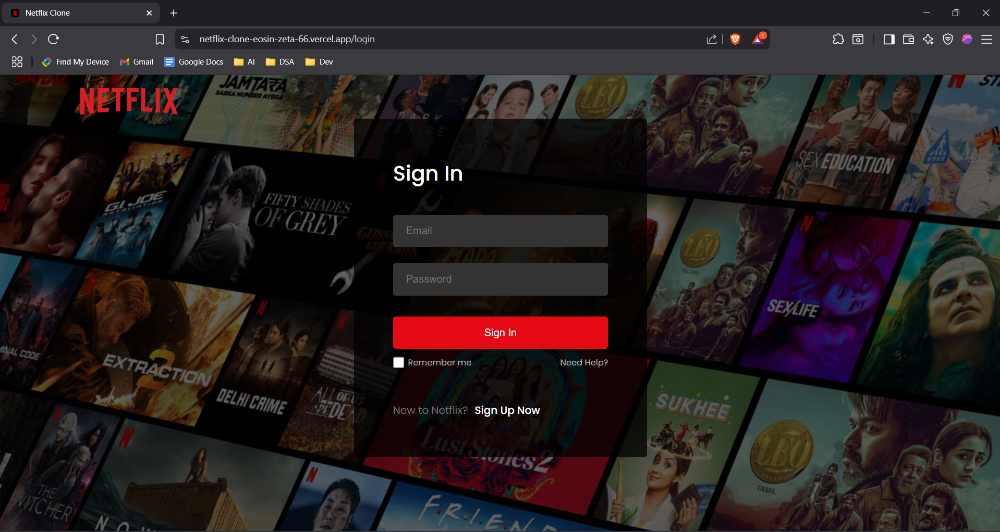
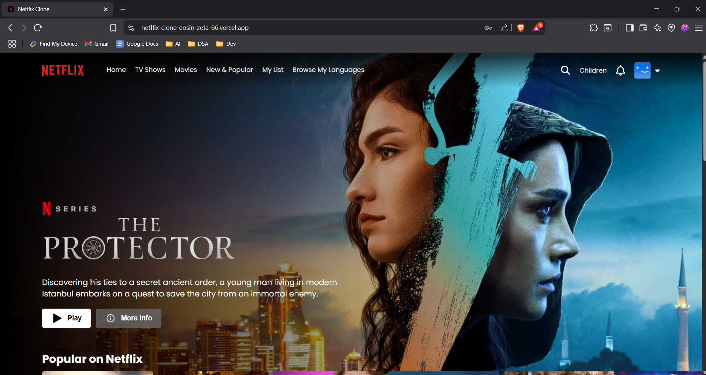
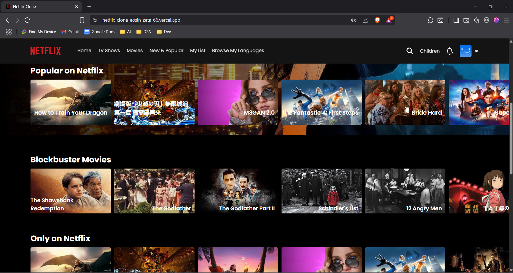
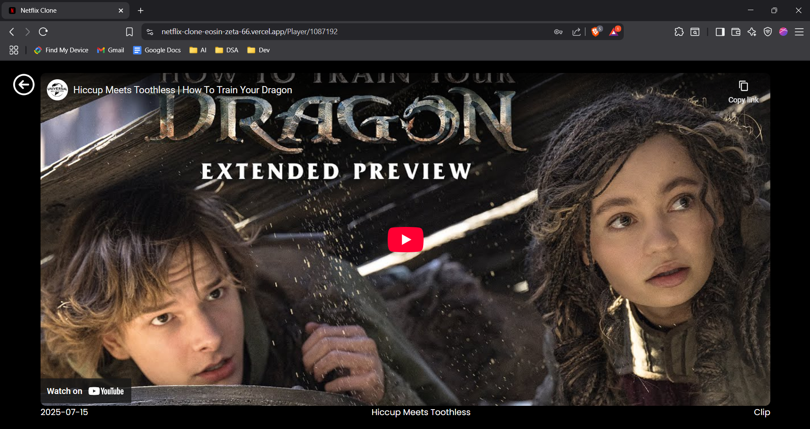

# Netflix Clone 🎬

A responsive **Netflix clone** built with React, Vite, and Firebase Authentication, powered by the TMDb API for real‑time movie data.  
Deployed on **Vercel**.

## Live Demo
👉 [netflix-clone-eosin-zeta-66.vercel.app](https://netflix-clone-eosin-zeta-66.vercel.app)

---

## Features
- 🔐 **Firebase Authentication** (Sign up, Login, Logout)
- 🎞️ **TMDb API Integration** for dynamic movie listings
- 📱 **Responsive UI** (mobile, tablet, and desktop friendly)
- 🎥 **Player Page** to stream selected content
- 🌓 **Modern design** inspired by Netflix

---

## Tech Stack
- **Frontend:** React, Vite, CSS3
- **Backend:** Firebase Authentication
- **API:** TMDb (The Movie Database)
- **Deployment:** Vercel

---

## Screenshots

### Login Page

### Home Page

### Player Page

---

